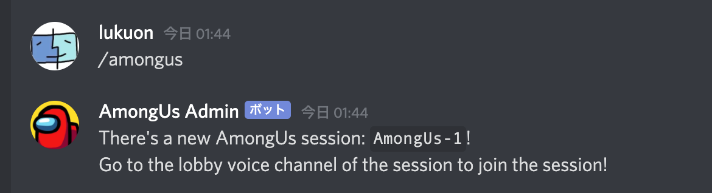
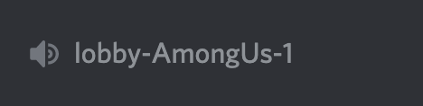
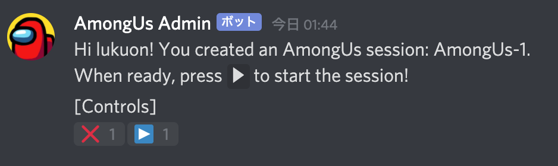
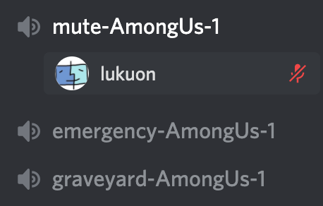
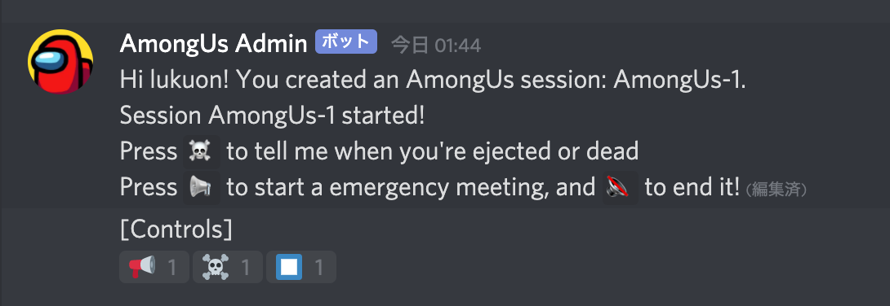
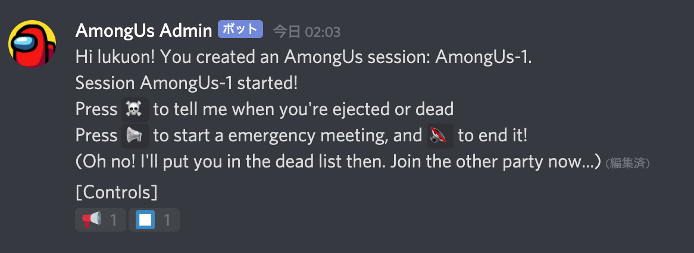
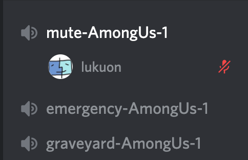
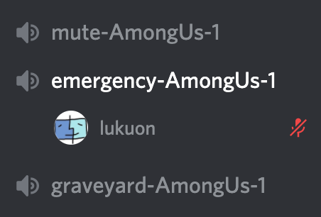
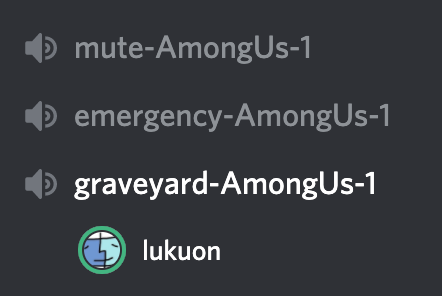

# amongus-admin \[beta version\]
A discord bot to control muting like AmongMuteUs, but manually.
It's not fully automatic, but you'll only need this bot to control muting.

AmongMuteUsのようにAmongUsを遊ぶ時にDiscordのミュートを管理してくれるBOTです。
ゲームと連動した全自動ではありませんが、簡単にミュートのオンオフを切り替えられます。

# How to install / インストール方法

[Invite Me](https://discord.com/oauth2/authorize?client_id=802513262854799390&permissions=29568016&scope=bot)

To install this bot to your server, you can simply use the OAuth2 link above.

Also, you can download this repository and run it locally by using a different BOT token.  
If the BOT is malfunctioning, first try running in local.

サーバーに招待するには、上のリンクを押してください！
また、このレポジトリをクローンして、自分で発行したDISCORD_BOT_TOKENを.envファイルに記入することでも招待できます。

BOTがうまく動かない場合はローカルインストールを試してみてください。

# How to use / 使用方法

1. Go to any channel of the server (that the bot can access) and type `/amongus`     どこかのチャンネル(BOTが認識できる場所)で`/amongus`と打つ

2. The bot will create a voice channel named "lobby-AmongUs-(number)". (The person created the session (= session admin) also must join the voice channel manually)   BOTが"ロビー-AmongUs-(数字)" というボイスチャンネルを作ります。セッションの作成者(=セッションadmin)もこのチャンネルに手動で参加する必要があります。

3. Invite people to that channel, and the bot will register them as the participants of the game.   BOTはロビーチャンネルを監視して、そのチャンネルの参加者をゲームの参加者として登録します。
4. After joining the channel, the bot will DM instructions. You can then control the session by reacting to the BOT's message.   ボイスチャンネルに参加するとBOTから説明が届きます。このメッセージにリアクションを行うことで状態を操作できます。

5. (admin) ▶️ {Start Button}: Start the session. Every one will be put into a muted channel   セッションを開始します。全員ミュートチャンネルに移動されます。

6. (anyone) ☠️ {Death Button}: Tell the bot you're dead. If it's not during the meeting, no one will see any changes.   BOTに死んだことを伝えます。緊急会議中でない限り他の人にはわかりません。

7. (admin) 📢 {Meeting Button}: Gather an emergency meeting. If someone is dead, that person will be muted.   緊急会議を招集します。死んでいる人は発言できません。

8. (admin) 🔇 {Mute Button}: End an emergency meeting. The dead people will go to the graveyard.   緊急会議を終了します。死んでいる人は墓地に移動します。

9. (admin) ⏹ {Stop Button}: End the session. Everyone will be back in the lobby, unmuted.   セッションを終了します。全員ロビーに戻り、ミュートが解除されます。

10. (admin) ❌ {Close Button}: Close the session. Everyone will be exited from the channel.   セッションを消去します。全員がVCを抜けます。
